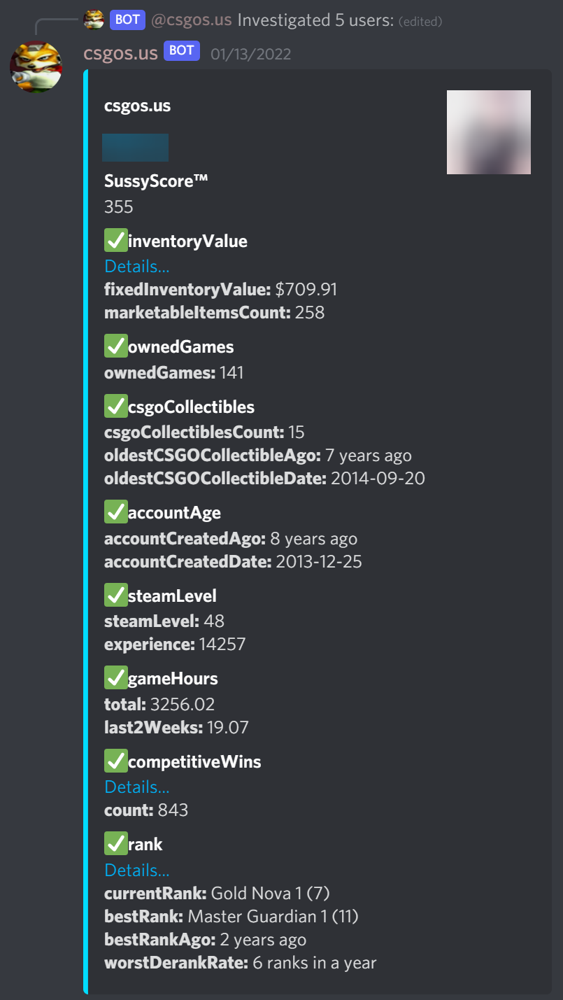

# csgo-sus

Lookup in-depth public data on CSGO players' accounts to see if they're suspicious

## Metrics

- [x] Account age
- [x] Steam level
- [x] Inventory value
- [x] Number of owned games
- [x] CSGO badges
- [x] Derank
- [x] Hours in CS
- [x] Number of competitive matches won
- [x] Player bans
- [x] Friend bans
- [x] Friend bans
- [x] Cheaters played with regularly
- [x] Steamrep
- [ ] Smurf finder
- [ ] Recent performance consistency
- [ ] Unusual statistics (HS%)
- [ ] Faceit
- [ ] Esportal
- [ ] SourceBans
- [ ] RustBanned
- [ ] ServerArmour

## Usage

1. Get the following API keys/tokens
   - [FaceIt](https://developers.faceit.com/)
   - [Steam](https://steamcommunity.com/dev/apikey)
   - [Discord](https://discord.com/developers/applications)
1. Deploy with Docker: `docker run --security-opt seccomp=unconfined -e STEAM_API_KEY=acb123 -e FACEIT_API_KEY=abc123 -e DISCORD_BOT_TOKEN=abc123 -v /my/mount/point:/csgo-sus ghcr.io/claabs/csgo-sus`
   - Technically, `seccomp=unconfined` is bad security practice, so instead you can use `seccomp="/path/to/seccomp_profile.json` with [this JSON file](https://github.com/ulixee/secret-agent/blob/main/tools/docker/seccomp_profile.json). This requirement comes from [here](https://github.com/ulixee/secret-agent/blob/main/tools/docker/run-core-server.sh)
1. Enable the "Message Content Intent" in the bot settings and add to your server using the link logged on startup

### Discord Bot

During algorithm development, a Discord bot is being used in lieu of a UI. Use `/help` to get instructions on how to use it

#### Example Low Trust Player

#### Example High Trust Player

### Web UI

Coming soon...
